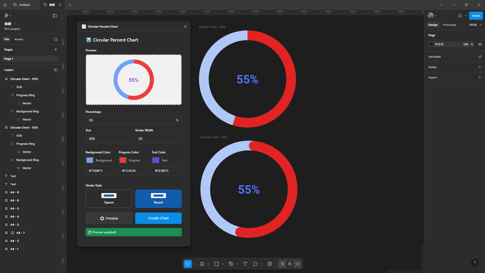

# 📊 Circular Percent Chart - Figma Plugin

A powerful and intuitive Figma plugin for creating beautiful circular percentage charts with customizable colors, sizes, stroke styles, and real-time preview.



## ✨ Features

### 🎨 **Visual Customization**

- **Adjustable Percentage**: Set any value from 0% to 100%
- **Custom Colors**: Choose background, progress, and text colors with color picker
- **Hex Color Input**: Enter colors using hex codes (#RRGGBB) with real-time sync
- **Size Control**: Chart sizes from 50px to 500px
- **Stroke Width**: Customize ring thickness from 5px to 50px (auto-limited to maintain proportions)
- **Stroke Styles**: Choose between Square (sharp edges) and Round (smooth rounded caps)

### 👁️ **Real-Time Preview**

- **Live Preview**: See your chart before creating it with accurate rendering
- **Accurate Scaling**: Preview respects actual size ratios and stroke proportions
- **Instant Updates**: Changes reflect immediately as you type
- **True-to-Output**: Preview matches final chart perfectly

### ⌨️ **Figma-like Shortcuts**

- **Arrow Keys**: Increment/decrement by 1 (↑/↓)
- **Shift + Arrow Keys**: Increment/decrement by 10 (⇧ + ↑/↓)
- **Professional Workflow**: Familiar keyboard shortcuts for fast editing

### 🎯 **Smart Features**

- **No Spinners**: Clean number inputs without distracting scroll arrows
- **Color Sync**: Color picker and hex input stay perfectly synchronized
- **Input Validation**: Automatic bounds checking and error prevention
- **Smart Constraints**: Stroke width auto-limited to maintain visual harmony
- **Modern UI**: Beautiful, responsive interface with visual stroke style selection

### 🛠️ **Advanced Options**

- **Stroke Cap Styles**:
  - **Square**: Sharp, clean edges (traditional style)
  - **Round**: Smooth, rounded caps (modern style)
- **Visual Compensation**: Round caps automatically adjusted for accurate percentage display
- **Proportional Scaling**: All elements scale correctly across different sizes

## ⚙️ Constraints & Validation

### Size Limits

- **Minimum Size**: 50px (ensures readability)
- **Maximum Size**: 500px (optimal performance)
- **Auto-Adjustment**: Values auto-correct to valid ranges

### Stroke Width Limits

- **Minimum Width**: 5px (visible stroke)
- **Maximum Width**: 50px (practical limit)
- **Smart Limiting**: Automatically prevents stroke from overwhelming the design

### Input Validation

- **Percentage**: 0-100% only
- **Hex Colors**: Auto-format and validate
- **Real-time Feedback**: Invalid inputs highlighted immediately

## 🔧 Development

### Build the plugin

```bash
npm run build
```

### Watch for changes

```bash
npm run watch
```

## 🚀 Installation

1. **Download** the plugin files
2. **Open Figma Desktop**
3. Go to **Plugins** → **Development** → **Import plugin from manifest**
4. Select the `manifest.json` file
5. **Run** the plugin from Plugins menu

### Architecture

```
src/
├── main.ts          # Main plugin logic and message handling
├── ui.ts            # Complete UI HTML with embedded CSS/JS
├── chart-creator.ts # SVG chart generation logic
├── types.ts         # TypeScript interfaces and types
└── utils.ts         # Helper functions and utilities
```

---

## 🤝 Contributing

We welcome contributions! Please feel free to:

- **Report bugs** via GitHub issues
- **Suggest features** for future versions
- **Submit pull requests** with improvements
- **Share feedback** on user experience
